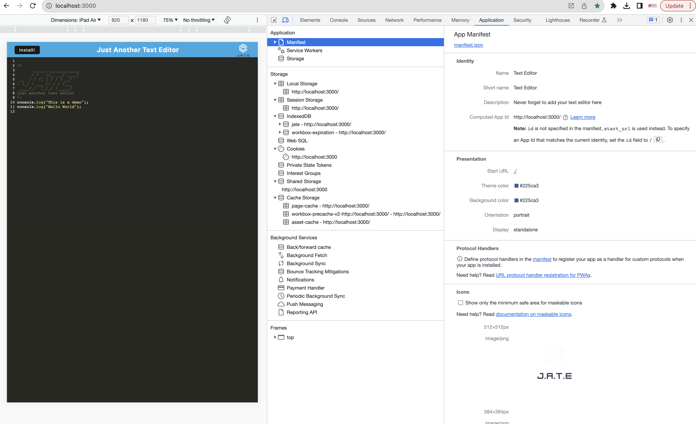
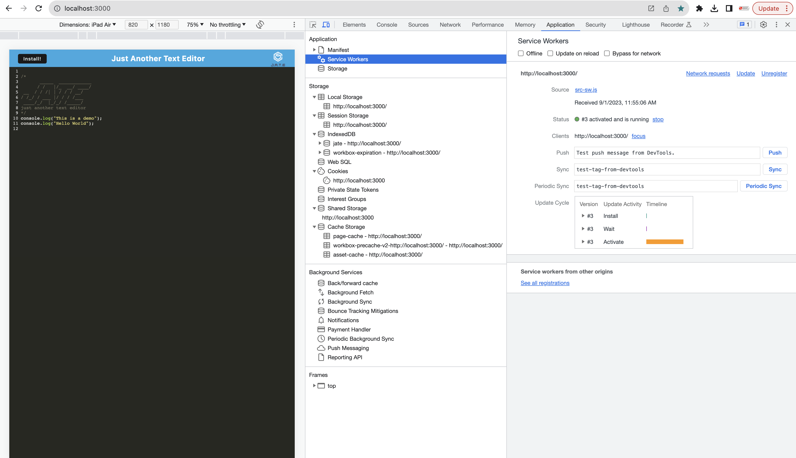
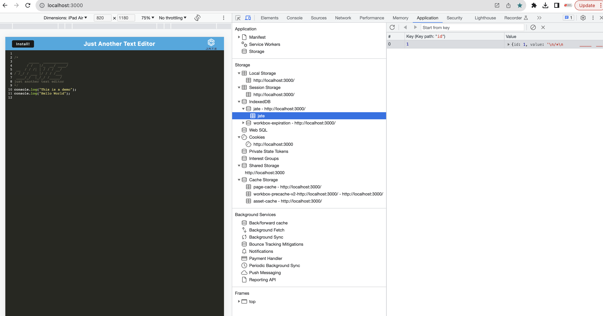

# 19 Progressive Web Applications (PWA): Text Editor

## Description

The JATE text editor is application accessible via the browser. It allows users to add code snippets that runs online and offline. This integrates a service worker and cache api that enables the application to function online. 

  ## Table of Contents
  - [Installation](#installation)
  - [Usage](#usage)
  - [Visuals](#visuals)
  - [Technologies Used](#technologies-used)
  - [License](#license)
  - [Contributing](#contributing)
  - [Questions](#questions)

  ## Installation
  On the command line terminal:
  1. Navigate to the repository folder 
  2. Download or clone the repository
  3. Run `npm install` to install the necessary dependencies
  4. Run `npm run build` 

  ## Usage
  1. Run `npm start`
  2. On the browser, type http://localhost:3000 to start using it. 

  ## Visuals
  The following animation demonstrates the application functionality:

  

  The following image shows the application's `manifest.json` file:

  

  The following image shows the application's registered service worker:

  

  The following image shows the application's IndexedDB storage:

  

  ## Technologies Used
  HTML, CSS, JS, Node.Js, Express.js, IndexedDB, PWA, and Heroku. 

  ## License
  MIT License

  ## Contributing
  If you would like to contribute to this project, please fork the project and submit a pull request.

  ## Questions
  For any additional questions, you can contact the author: mayperalta@gmail.com. 

